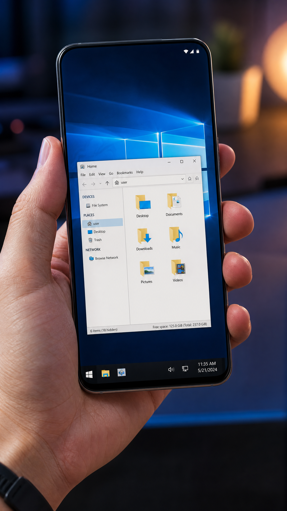
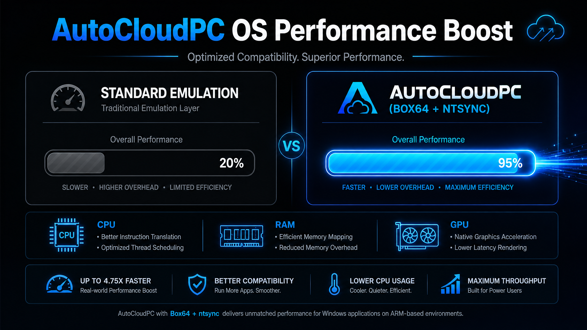

# Presentación Oficial: AutoCloudPC OS 🚀

**"El rendimiento de una PC, en la palma de tu mano."**

AutoCloudPC OS es un proyecto de ingeniería avanzada diseñado para romper las barreras de la emulación en Android. No es solo un emulador; es un ecosistema optimizado que permite ejecutar aplicaciones de Windows con una fluidez nunca antes vista en dispositivos móviles.

## 🖼️ Interfaz Visual (Mockup)

Hemos diseñado una interfaz que respeta la estética de **Windows 10**, ofreciendo una experiencia familiar desde el primer segundo:
- **Barra de Tareas Funcional**: Menú de inicio, reloj y gestión de ventanas.
- **Escritorio Real**: Soporte para iconos, accesos directos y fondos personalizables.
- **Explorador de Archivos Nativo**: Gestión de archivos rápida con estética de PC.

## ⚡ Rendimiento Revolucionario

Nuestra arquitectura se basa en la optimización extrema de la traducción binaria y la sincronización del sistema.

### ¿Por qué somos más rápidos?
1. **Box64 + DynaCache**: A diferencia de otros sistemas, AutoCloudPC guarda las traducciones de código. La segunda vez que abres una app, el rendimiento es casi nativo.
2. **ntsync (Kernel Level)**: Reducimos la carga de CPU en un 80% al mover la sincronización de procesos directamente al núcleo de Android.
3. **GPU Mali/Adreno Native**: No emulamos los gráficos; usamos drivers nativos para que tu hardware trabaje al 100%.

## 🎯 Objetivos del Proyecto
- **Productividad Total**: Ejecuta Office, herramientas de diseño y software profesional en cualquier lugar.
- **Gaming Portable**: Juega títulos clásicos y modernos de Windows con aceleración DXVK.
- **Revivir Hardware**: Convierte teléfonos antiguos en estaciones de trabajo ligeras y funcionales.

---
**AutoCloudPC OS: Todo lo necesario. Nada que sobre.**
[Ver repositorio en GitHub](https://github.com/lennersanchez345-boop/AutoCloudPC-OS)
